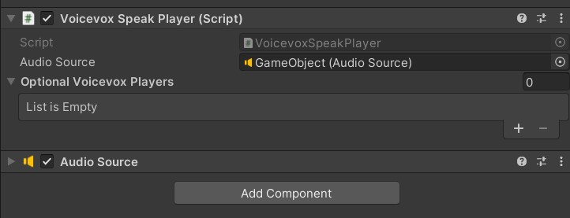
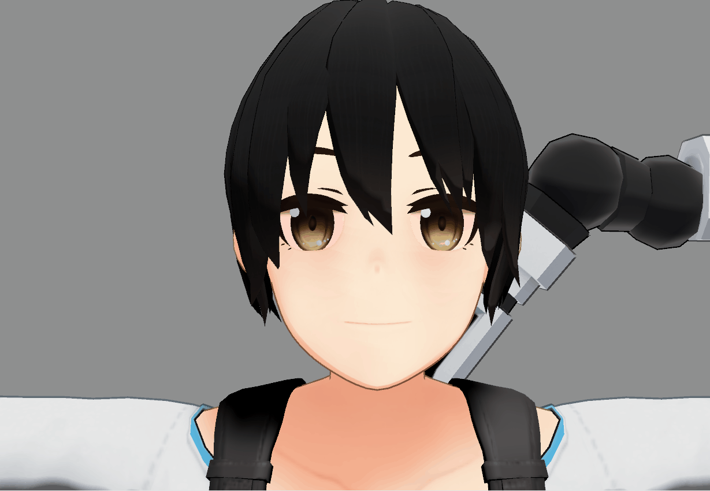
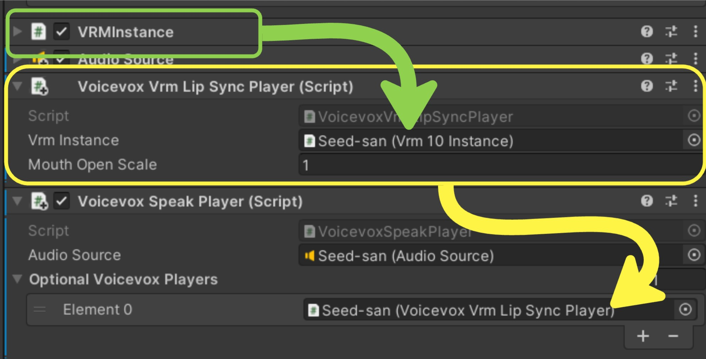
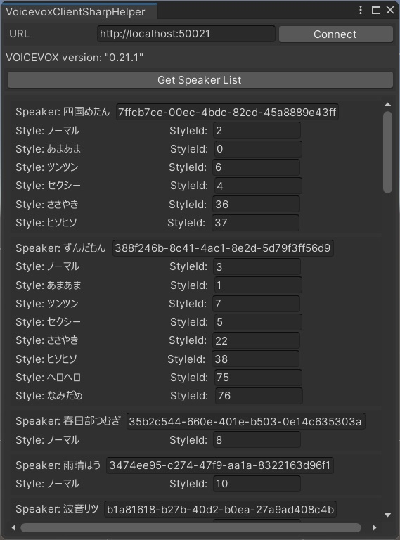
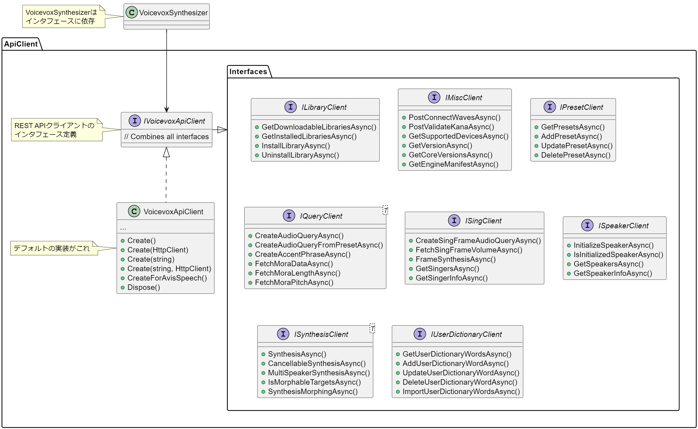
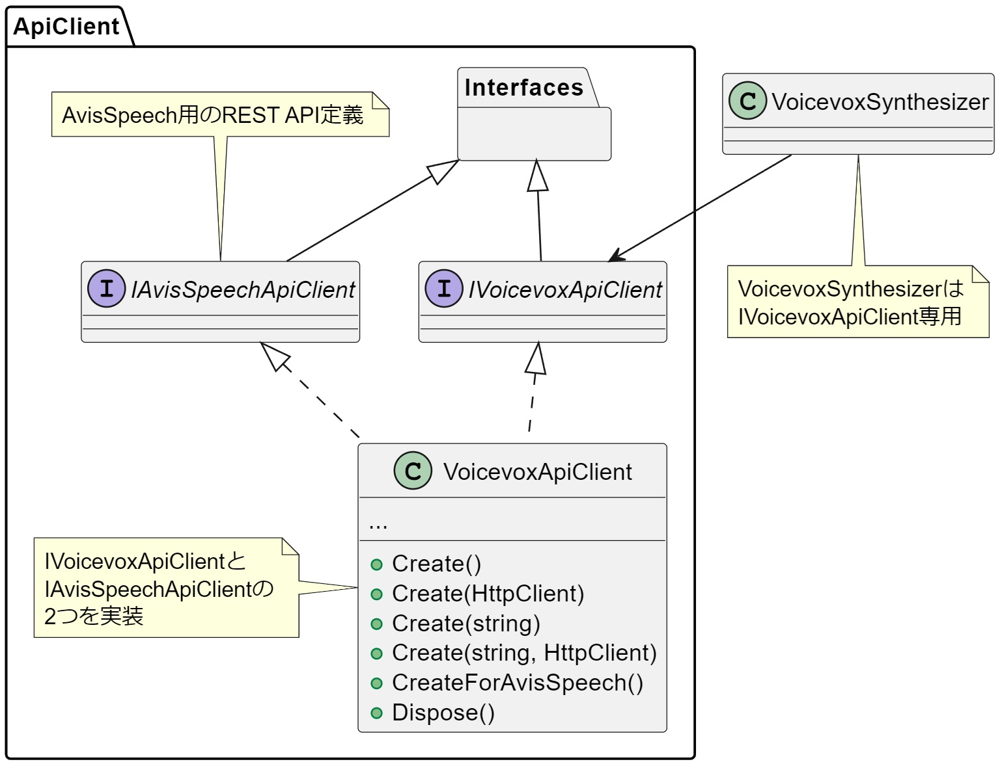

# VoicevoxClientSharp

[VOIVEVOX.exe](https://voicevox.hiroshiba.jp/)および[voicevox_engine](https://github.com/VOICEVOX/voicevox_engine)および[AvisSpeech](https://aivis-project.com/)をC#から制御するためのクライアントライブラリです。 


* 対象プラットフォーム: `.NET Standard 2.0`
  * .NET Core 2.0以降
  * .NET Framework 4.6.1以降
  * Unity 2018.4以降
  * etc.

* 対応VOICEVOXエンジンバージョン: `0.21.1`
* 対応AvisSpeechバージョン: `1.0.0`


またUnityでの動作をサポートするプラグインも別途配布しています。そちらを使用することで[VRM](https://vrm.dev/)と連携して使用することもできます。

* 対応VRMバージョン: `v0.128.0`


- [VoicevoxClientSharp](#voicevoxclientsharp)
  - [依存ライブラリ](#依存ライブラリ)
  - [LICENSE](#license)
  - [インストール方法](#インストール方法)
  - [使い方](#使い方)
    - [A.VoicevoxSynthesizer : 音声合成の簡易に行うためのクラス](#avoicevoxsynthesizer--音声合成の簡易に行うためのクラス)
    - [B. VoicevoxApiClient : REST APIを実行するシンプルなクライアント実装](#b-voicevoxapiclient--rest-apiを実行するシンプルなクライアント実装)
    - [例外発生時](#例外発生時)
  - [Unity向けの追加機能](#unity向けの追加機能)
    - [VoicevoxSpeakPlayer : Unity上での発話制御コンポーネント](#voicevoxspeakplayer--unity上での発話制御コンポーネント)
    - [VoicevoxVrmLipSyncPlayer : VRMアバターをリップシンクするコンポーネント](#voicevoxvrmlipsyncplayer--vrmアバターをリップシンクするコンポーネント)
    - [OptionalVoicevoxPlayer : VoicevoxSpeakPlayerと連携するためのベースクラス](#optionalvoicevoxplayer--voicevoxspeakplayerと連携するためのベースクラス)
    - [エディタ拡張](#エディタ拡張)
  - [構成](#構成)
  - [依存ライブラリのライセンス表記](#依存ライブラリのライセンス表記)
    


## 依存ライブラリ

### VoicevoxClientSharp本体<!-- omit in toc -->

 * [System.Text.Json](https://www.nuget.org/packages/System.Text.Json)
 * [System.Threading.Tasks.Extensions](https://www.nuget.org/packages/system.threading.tasks.extensions/)

 ### VoicevoxClientSharp.Unity（Unity向けプラグイン）<!-- omit in toc -->

 * [System.Text.Json](https://www.nuget.org/packages/System.Text.Json)
 * [System.Threading.Tasks.Extensions](https://www.nuget.org/packages/system.threading.tasks.extensions/)
 * [UniTask](https://github.com/Cysharp/UniTask)

 ### VoicevoxClientSharpTest(テストプロジェクト)<!-- omit in toc -->

 * [System.Text.Json](https://www.nuget.org/packages/System.Text.Json)
 * [System.Threading.Tasks.Extensions](https://www.nuget.org/packages/system.threading.tasks.extensions/)
 * [NAudio](https://www.nuget.org/packages/NAudio)
 * [NUnit](https://www.nuget.org/packages/nunit)


## LICENSE

MIT


## インストール方法

### .NET環境向けのインストール方法<!-- omit in toc -->

NuGetパッケージマネージャーからインストールすることができます。

```
Install-Package VoicevoxClientSharp
```

### Unity向けのインストール方法<!-- omit in toc -->

#### 1. UniTaskを導入する<!-- omit in toc -->

 [UniTaskのREADME](https://github.com/Cysharp/UniTask?tab=readme-ov-file#upm-package)を参考に、UnityプロジェクトにUniTaskを導入してください。


#### 2. `VoicevoxClientSharp`をUnityプロジェクトに導入する<!-- omit in toc -->

Unityプロジェクトに`VoicevoxClientSharp`を導入してください。

[NuGetForUnity](https://github.com/GlitchEnzo/NuGetForUnity?tab=readme-ov-file#how-do-i-install-nugetforunity)をUnityに導入し、そちらから`VoicevoxClientSharp`をインストールする方法を推奨します。


#### 3. `VoicevoxClientSharp.Unity`をUPMより参照してインストール<!-- omit in toc -->

UPMより次のURLから`VoicevoxClientSharp.Unity`を導入してください。

```
https://github.com/TORISOUP/VoicevoxClientSharp?path=VoicevoxClientSharp.Unity/Assets/VoicevoxClientSharp.Unity
```


## 使い方

テキストから音声合成を簡単にやりたい → `VoicevoxSynthesizer`  
VOICEVOXが提供するREST APIを個別に実行したい → `VoicevoxApiClient`

### A.VoicevoxSynthesizer : 音声合成の簡易に行うためのクラス

`VoicevoxSynthesizer`を用いることでテキストから音声合成を簡単に実行できます。
また音声合成に必要な下準備も簡易ですが行うことができます。

※ **VoicevoxSynthesizerはAvisSpeechには対応していません。VOICEVOX専用です。**

#### A-1. 基本的な使い方<!-- omit in toc -->


```cs
// VoicevoxSynthesizerの初期化
using var synthesizer = new VoicevoxSynthesizer();

// スタイルIDを取得
// StyleIdが既知の場合はこのステップは不要
int styleId = (await synthesizer.FindStyleIdByNameAsync(speakerName: "ずんだもん", styleName: "あまあま"))!.Value;

// スタイルを初期化
// 省略可能だが、省略すると初回の合成時に時間がかかる
await synthesizer.InitializeStyleAsync(styleId);

// 音声合成を実行
// resultに合成結果のwavデータ(byte[])が可能されている
SynthesisResult result = await synthesizer.SynthesizeSpeechAsync(styleId, "こんにちは、世界！");
```

`SynthesisResult`には発話に使用したクエリ（`AudioQuery`）と合成結果のwav（`byte[]`）が含まれています。


```cs
/// <summary>
/// VOICEVOXの発話音声の合成結果
/// </summary>
public readonly struct SynthesisResult : IEquatable<SynthesisResult>
{
    /// <summary>
    /// 合成した音声データ
    /// </summary>
    public byte[] Wav { get; }

    /// <summary>
    /// 音声合成に使用したクエリ
    /// </summary>
    public AudioQuery AudioQuery { get; }

    /// <summary>
    /// 音声合成に使用したテキスト
    /// </summary>
    public string Text { get; }
}
```

#### A-2. 音声合成のパラメータ指定<!-- omit in toc -->

```csharp
// 個別のパラメータを指定した音声合成も可能
var result = await synthesizer.SynthesizeSpeechAsync(styleId, "こんにちは、世界！",
        speedScale: 1.1M,
        pitchScale: 0.1M,
        intonationScale: 1.1M,
        volumeScale: 0.5M,
        prePhonemeLength: 0.1M,
        postPhonemeLength: 0.1M,
        pauseLength: 0.1M,
        pauseLengthScale: 1.5M);
```
```cs
// VOICEVOXに登録されたプリセットを用いて音声合成も可能
result = await synthesizer.SynthesizeSpeechWithPresetAsync(presetId: 1, "こんにちは、世界！");
```

#### A-3. モーフィング<!-- omit in toc -->

```cs
// 2つのスタイルが合成可能であるか
var isMorphable = await synthesizer.CanMorphAsync(baseStyleId: 0, targetStyleId: 2);
if (isMorphable)
{
    // 合成可能なら半々の割合でモーフィング
    var result = await synthesizer.SpeakMorphingAsync(0, 2, 0.5M, "こんにちは、世界！");
}
```

#### A-4. 接続先の変更<!-- omit in toc -->

コンストラクタ引数を何も指定しない場合は`http://localhost:50021`を接続先として初期化します。
接続先を変更したい場合は`VoicevoxApiClient`を手動で生成し、`VoicevoxSynthesizer`のコンストラクタに渡してください。

```cs
// 接続先を指定したい場合はVoicevoxApiClientを手動で生成し、コンストラクタに渡してください
var apiClient = VoicevoxApiClient.Create(baseUri: "http://localhost:50021");
using var synthesizer = new VoicevoxSynthesizer(apiClient);
```

### B. VoicevoxApiClient : REST APIを実行するシンプルなクライアント実装

`VoicevoxApiClient`はVOICEVOX（およびAvisSpeech）が提供するREST APIと1:1に対応した"シンプル"なクライアントです。


#### B-1. 使い方<!-- omit in toc -->

[VOICEVOXのAPIドキュメント](https://voicevox.github.io/voicevox_engine/api/)を参考に、実行したいAPIに対応したメソッドを呼び出してください。


| REST API Endpoint                            | HTTP Method | メソッド名                                    | 説明                                           |
|----------------------------------------------|-------------|-----------------------------------------------|----------------------------------------------|
| `/downloadable_libraries`                    | GET         | `GetDownloadableLibrariesAsync`              | ライブラリ情報一覧を取得する                   |
| `/installed_libraries`                       | GET         | `GetInstalledLibrariesAsync`                 | インストール済み音声ライブラリ情報を取得する    |
| `/install_library/{library_uuid}`            | POST        | `InstallLibraryAsync`                        | 音声ライブラリをインストールする               |
| `/uninstall_library/{library_uuid}`          | POST        | `UninstallLibraryAsync`                      | 音声ライブラリをアンインストールする           |
| `/connect_waves`                             | POST        | `PostConnectWavesAsync`                      | 複数のWAVデータを1つに統合する                 |
| `/validate_kana`                             | POST        | `PostValidateKanaAsync`                      | AquesTalk風記法のバリデーション                 |
| `/supported_devices`                         | GET         | `GetSupportedDevicesAsync`                   | 対応デバイス一覧を取得する                     |
| `/version`                                   | GET         | `GetVersionAsync`                            | エンジンのバージョンを取得する                 |
| `/core_versions`                             | GET         | `GetCoreVersionsAsync`                       | 利用可能なコアのバージョン一覧を取得する       |
| `/engine_manifest`                           | GET         | `GetEngineManifestAsync`                     | エンジンのマニフェストを取得する               |
| `/presets`                                   | GET         | `GetPresetsAsync`                            | プリセット設定を取得する                        |
| `/add_preset`                                | POST        | `AddPresetAsync`                             | 新しいプリセットを追加する                     |
| `/update_preset`                             | POST        | `UpdatePresetAsync`                          | プリセットを更新する                            |
| `/delete_preset`                             | POST        | `DeletePresetAsync`                          | プリセットを削除する                            |
| `/audio_query`                               | POST        | `CreateAudioQueryAsync`                      | 音声合成用クエリを作成する                     |
| `/audio_query_from_preset`                   | POST        | `CreateAudioQueryFromPresetAsync`            | プリセットを用いて音声合成用クエリを作成する    |
| `/accent_phrases`                            | POST        | `CreateAccentPhraseAsync`                    | アクセント句を取得する                          |
| `/mora_data`                                 | POST        | `FetchMoraDataAsync`                         | アクセント句から音高・音素長を取得する           |
| `/mora_length`                               | POST        | `FetchMoraLengthAsync`                       | アクセント句から音素長を取得する                |
| `/mora_pitch`                                | POST        | `FetchMoraPitchAsync`                        | アクセント句から音高を取得する                  |
| `/sing_frame_audio_query`                    | POST        | `CreateSingFrameAudioQueryAsync`             | 歌唱音声合成用クエリを作成する                 |
| `/sing_frame_volume`                         | POST        | `FetchSingFrameVolumeAsync`                  | フレームごとの音量を取得する                    |
| `/frame_synthesis`                           | POST        | `FrameSynthesisAsync`                        | 歌唱音声合成を実行する                          |
| `/singers`                                   | GET         | `GetSingersAsync`                            | 歌唱可能なキャラクター一覧を取得する            |
| `/singer_info`                               | GET         | `GetSingerInfoAsync`                         | キャラクターの詳細情報を取得する                |
| `/initialize_speaker`                        | POST        | `InitializeSpeakerAsync`                     | スピーカーのスタイルを初期化する                |
| `/is_initialized_speaker`                    | GET         | `IsInitializedSpeakerAsync`                  | スピーカーが初期化されているか確認する          |
| `/speakers`                                  | GET         | `GetSpeakersAsync`                           | 喋れるキャラクター一覧を取得する                |
| `/speaker_info`                              | GET         | `GetSpeakerInfoAsync`                        | キャラクターの詳細情報を取得する                |
| `/synthesis`                                 | POST        | `SynthesisAsync`                             | 音声合成を行う                                  |
| `/cancellable_synthesis`                     | POST        | `CancellableSynthesisAsync`                  | キャンセル可能な音声合成を行う                  |
| `/multi_synthesis`                           | POST        | `MultiSpeakerSynthesisAsync`                 | 複数の音声合成をまとめて行う                   |
| `/user_dict`                                 | GET         | `GetUserDictionaryWordsAsync`                | ユーザー辞書の単語一覧を取得する                |
| `/user_dict_word`                            | POST        | `AddUserDictionaryWordAsync`                 | ユーザー辞書に単語を追加する                    |
| `/user_dict_word/{word_uuid}`                | POST        | `UpdateUserDictionaryWordAsync`              | ユーザー辞書の単語を更新する                    |
| `/user_dict_word/{word_uuid}`                | DELETE      | `DeleteUserDictionaryWordAsync`              | ユーザー辞書の単語を削除する                    |
| `/import_user_dict`                          | POST        | `ImportUserDictionaryWordsAsync`             | 他のユーザー辞書をインポートする                |


##### 使用例：音声合成をVoicevoxApiClientで行う<!-- omit in toc -->

```cs
// APIクライアントを生成
using var apiClient = VoicevoxApiClient.Create();

// GET /speakers
// スピーカー一覧を取得
var speakers = await apiClient.GetSpeakersAsync();

// スピーカー名とスタイル名からスタイルIDを取得
var speaker = speakers.FirstOrDefault(s => s.Name == "ずんだもん");
var styleId = speaker?.Styles.FirstOrDefault(x => x.Name == "あまあま")!.Id ?? 0;

// POST /audio_query
// 音声合成用のクエリを作成
var audioQuery = await apiClient.CreateAudioQueryAsync("こんにちは、世界！", styleId);

// POST /synthesis
// 音声合成を実行
byte[] wav = await apiClient.SynthesisAsync(styleId, audioQuery);
```


#### B-2. 初期化:VOICEVOXにつなぐ<!-- omit in toc -->

VOICEVOXと通信する場合は`VoicevoxApiClient`をそのまま使用してください。

```cs
// VOICEVOXに接続する
using var voicevoxApiClient1 = new VoicevoxApiClient();

// VoicevoxApiClient.Createを使用してもよい
using var voicevoxApiClient2 = VoicevoxApiClient.Create();
```

また、引数として接続先情報と`HttpClient`を指定できます。接続方法をカスタムしたい場合に利用してください。
なお引数で`HttpClient`を指定した場合、その`HttpClient`の`Dispose()`は`VoicevoxApiClient`側で呼び出すことはありません。

```cs
// デフォルトの接続先で初期化 : http://localhost:50021
using var apiClient = VoicevoxApiClient.Create();
```

```cs
// 接続先を指定して初期化
using var apiClient = VoicevoxApiClient.Create(baseUri: "http://localhost:50021");
```

```cs
// HttpClientを指定
var httpClient = new HttpClient()
{
    // タイムアウトを5秒に設定
    Timeout = TimeSpan.FromSeconds(5)
};
// HttpClientを指定して生成
var apiClient = VoicevoxApiClient.Create(httpClient);

// ...

// VoicevoxApiClientのDispose()
apiClient.Dispose();

// HttpClientのケアは行わないので不要になったタイミングで手動Dispose()が必要
httpClient.Dispose();
```

```cs
// HttpClientと接続先を指定することも可能
using var apiClient = VoicevoxApiClient.Create(baseUri: "http://localhost:50021", httpClient);
```


#### B-3. 初期化:AviSpeechにつなぐ<!-- omit in toc -->

AviSpeechに接続する場合は、`VoicevoxApiClient`を`IAvisSpeechApiClient`インタフェースに明示的にキャストする必要があります。

```cs
// IAvisSpeechApiClientに明示的にキャスト
using var avisSpeechApiClient1 = new VoicevoxApiClient() as IAvisSpeechApiClient;

// VoicevoxApiClient.CreateForAvisSpeechを使用してもよい
using var avisSpeechApiClient2 = VoicevoxApiClient.CreateForAvisSpeech();
```

### 例外発生時

例外発生時は`VoicevoxClientException`が発行されます。


## Unity向けの追加機能

Unityにおいても`VoicevoxSynthesizer`および`VoicevoxApiClient`が使用可能です。  

また追加で`VoicevoxClientSharp.Unity`プラグインを導入することで次の機能が使用可能になります。

* `VoicevoxSpeakPlayer` : Unity上での発話制御コンポーネント
* `VoicevoxVrmLipSyncPlayer` : VRMアバターをリップシンクするコンポーネント

### VoicevoxSpeakPlayer : Unity上での発話制御コンポーネント


`VoicevoxSpeakPlayer`はVOICEVOXで合成した音声をUnityのAudioSourceを用いて再生するコンポーネントです。  
GameObjectにアタッチし、AudioSourceをバインドしてから使用してください。



```cs
using System.Threading;
using Cysharp.Threading.Tasks;
using UnityEngine;
using VoicevoxClientSharp;
using VoicevoxClientSharp.Unity;

namespace Sandbox
{
    // 使用例
    public class Sample : MonoBehaviour
    {
        // 設定済みのVoicevoxSpeakPlayerをバインドしておく
        [SerializeField] private VoicevoxSpeakPlayer _voicevoxSpeakPlayer;

        private readonly VoicevoxSynthesizer _voicevoxSynthesizer 
            = new VoicevoxSynthesizer();

        private void Start()
        {
            var cancellationToken = this.GetCancellationTokenOnDestroy();

            // テキストを音声に変換して再生
            SpeakAsync("こんにちは、世界", cancellationToken).Forget();
        }

        private async UniTask SpeakAsync(string text, CancellationToken ct)
        {
            // テキストをVoicevoxで音声合成
            var synthesisResult = await _voicevoxSynthesizer.SynthesizeSpeechAsync(
                0, text, cancellationToken: ct);
            
            // 音声を再生
            await _voicevoxSpeakPlayer.PlayAsync(synthesisResult, ct);
        }

        private void OnDestroy()
        {
            _voicevoxSynthesizer.Dispose();
        }
    }
}
```

### VoicevoxVrmLipSyncPlayer : VRMアバターをリップシンクするコンポーネント

`VoicevoxVrmLipSyncPlayer`はVRMアバターをVOICEVOXの音声再生に合わせてリップシンクするコンポーネントです。  
[UniVRM](https://github.com/vrm-c/UniVRM)をUnityプロジェクトにインポートしている時のみ使用できます。




#### 使い方<!-- omit in toc -->

1. `VoicevoxVrmLipSyncPlayer` を任意のGameObjectにアタッチする
2. インスタンス化したVRMアバターの`Vrm10Instance`を`VoicevoxVrmLipSyncPlayer`にバインドする
3. `VoicevoxVrmLipSyncPlayer`を`VoicevoxSpeakPlayer`にバインドする
4. `VoicevoxSpeakPlayer`の`PlayAsync()`を実行する


（インスタンス化済みのVRMでセットアップする場合。動的にセットアップしてもOK）


```cs
using System.Threading;
using Cysharp.Threading.Tasks;
using UnityEngine;
using UniVRM10;
using VoicevoxClientSharp;
using VoicevoxClientSharp.Unity;

namespace Sandbox
{
    /// <summary>
    /// すべてをスクリプトからセットアップする場合
    /// </summary>
    public sealed class LoadVrmAndSpeech : MonoBehaviour
    {
        [SerializeField] private string _vrmPath = "";

        private readonly VoicevoxSynthesizer _voicevoxSynthesizer = new VoicevoxSynthesizer();

        private void Start()
        {
            var cancellationToken = this.GetCancellationTokenOnDestroy();

            LoadVrmAndSpeechAsync(_vrmPath, cancellationToken).Forget();
        }

        private async UniTask LoadVrmAndSpeechAsync(string path, CancellationToken ct)
        {
            // バイナリファイルを読み込んでVRMをロード
            var vrm10Instance = await Vrm10.LoadPathAsync(path, ct: ct);
            var vrmGameObject = vrm10Instance.gameObject;

            // AudioSourceを用意
            var audioSource = vrmGameObject.AddComponent<AudioSource>();

            // VoicevoxSpeakPlayerを追加してAudioSourceを設定
            var voicevoxSpeakPlayer = vrmGameObject.AddComponent<VoicevoxSpeakPlayer>();
            voicevoxSpeakPlayer.AudioSource = audioSource;

            // VoicevoxVrmLipSyncPlayerを追加して、VrmInstanceを設定
            // VoicevoxVrmLipSyncPlayer自体は別のGameObjectにアタッチしてあっても良いが、
            // VRMのGameObjectにアタッチしておいた方が管理しやすい
            var voicevoxVrmLipSyncPlayer = vrmGameObject.AddComponent<VoicevoxVrmLipSyncPlayer>();
            voicevoxVrmLipSyncPlayer.VrmInstance = vrm10Instance;

            // VoicevoxSpeakPlayerにVoicevoxVrmLipSyncPlayerを追加
            voicevoxSpeakPlayer.AddOptionalVoicevoxPlayer(voicevoxVrmLipSyncPlayer);

            // テキストを音声に変換
            var synthesisResult = await _voicevoxSynthesizer.SynthesizeSpeechAsync(
                0, "こんにちは、世界", cancellationToken: ct);

            // 音声を再生しながらリップシンク
            await voicevoxSpeakPlayer.PlayAsync(synthesisResult, ct);
        }
    }
}
```

### OptionalVoicevoxPlayer : VoicevoxSpeakPlayerと連携するためのベースクラス

`OptionalVoicevoxPlayer`は`VoicevoxSpeakPlayer`に連動させる機能を自分で拡張したい時に利用するベースクラスです。
このクラスを継承したものを`VoicevoxSpeakPlayer`に登録して使用してください。

```cs
namespace VoicevoxClientSharp.Unity
{
    /// <summary>
    /// VoicevoxSpeakPlayerと連携するためのクラス
    /// </summary>
    public abstract class OptionalVoicevoxPlayer : MonoBehaviour
    {
        /// <summary>
        /// 再生中かどうか
        /// </summary>
        public bool IsPlaying { get; protected set; }
        
        /// <summary>
        /// 再生を開始する
        /// </summary>
        public abstract UniTask PlayAsync(SynthesisResult synthesisResult, CancellationToken cancellationToken);
    }
}
```


### エディタ拡張

[VoicevoxClientSharp -> Open HelperWindow]より、VOICEVOXからスピーカー一覧を取得するエディタ拡張を開くことができます。




## 構成

### 全体構成<!-- omit in toc -->



APIクライントは`IVoicevoxApiClient`インタフェースにより抽象化が行われており、`VoicevoxSynthesizer`はこのインタフェースに依存しています。

必要であれば`IVoicevoxApiClient`の実装を独自のものに差し替えて利用してください。

### AvisSpeech対応<!-- omit in toc -->



AvisSpeechと通信するクライアントは`IAvisSpeechApiClient`インタフェースにより抽象化されています。

実装は共通した`VoicevoxApiClient`で行っていますが、`IVoicevoxApiClient`と`IAvisSpeechApiClient`で定義が異なるためインタフェースを介すことで適切なAPIのみが呼び出せるようになっています。そのため**VoicevoxApiClientはインスタンス化したあとはそれぞれのインタフェースにキャストして扱うことを推奨します。**

```cs
/// <summary>
/// VOICEVOX用の定義
/// </summary>
public interface IVoicevoxApiClient :
    IQueryClient<AudioQuery>,
    ISynthesisClient<AudioQuery>,
    IMiscClient,
    ISpeakerClient,
    ISingClient,
    IPresetClient,
    ILibraryClient,
    IUserDictionaryClient
{
}

/// <summary>
/// AvisSpeech用の定義
/// </summary>
public interface IAvisSpeechApiClient :
    IQueryClient<AvisSpeechAudioQuery>, // データ構造が異なる
    ISynthesisClient<AvisSpeechAudioQuery>,　// データ構造が異なる
    IMiscClient,
    ISpeakerClient,
    // ISingClient, AvisSpeechではSing系のAPIが利用できない
    IPresetClient,
    ILibraryClient,
    IUserDictionaryClient
{
}
```

## 依存ライブラリのライセンス表記

#### dotnet/runtime<!-- omit in toc -->

The MIT License (MIT)

Copyright (c) .NET Foundation and Contributors

All rights reserved.

Permission is hereby granted, free of charge, to any person obtaining a copy
of this software and associated documentation files (the "Software"), to deal
in the Software without restriction, including without limitation the rights
to use, copy, modify, merge, publish, distribute, sublicense, and/or sell
copies of the Software, and to permit persons to whom the Software is
furnished to do so, subject to the following conditions:

The above copyright notice and this permission notice shall be included in all
copies or substantial portions of the Software.

THE SOFTWARE IS PROVIDED "AS IS", WITHOUT WARRANTY OF ANY KIND, EXPRESS OR
IMPLIED, INCLUDING BUT NOT LIMITED TO THE WARRANTIES OF MERCHANTABILITY,
FITNESS FOR A PARTICULAR PURPOSE AND NONINFRINGEMENT. IN NO EVENT SHALL THE
AUTHORS OR COPYRIGHT HOLDERS BE LIABLE FOR ANY CLAIM, DAMAGES OR OTHER
LIABILITY, WHETHER IN AN ACTION OF CONTRACT, TORT OR OTHERWISE, ARISING FROM,
OUT OF OR IN CONNECTION WITH THE SOFTWARE OR THE USE OR OTHER DEALINGS IN THE
SOFTWARE.

#### dotnet/maintenance-packages<!-- omit in toc -->

The MIT License (MIT)

Copyright (c) .NET Foundation and Contributors

All rights reserved.

Permission is hereby granted, free of charge, to any person obtaining a copy
of this software and associated documentation files (the "Software"), to deal
in the Software without restriction, including without limitation the rights
to use, copy, modify, merge, publish, distribute, sublicense, and/or sell
copies of the Software, and to permit persons to whom the Software is
furnished to do so, subject to the following conditions:

The above copyright notice and this permission notice shall be included in all
copies or substantial portions of the Software.

THE SOFTWARE IS PROVIDED "AS IS", WITHOUT WARRANTY OF ANY KIND, EXPRESS OR
IMPLIED, INCLUDING BUT NOT LIMITED TO THE WARRANTIES OF MERCHANTABILITY,
FITNESS FOR A PARTICULAR PURPOSE AND NONINFRINGEMENT. IN NO EVENT SHALL THE
AUTHORS OR COPYRIGHT HOLDERS BE LIABLE FOR ANY CLAIM, DAMAGES OR OTHER
LIABILITY, WHETHER IN AN ACTION OF CONTRACT, TORT OR OTHERWISE, ARISING FROM,
OUT OF OR IN CONNECTION WITH THE SOFTWARE OR THE USE OR OTHER DEALINGS IN THE
SOFTWARE.

#### UniTask<!-- omit in toc -->

The MIT License (MIT)

Copyright (c) 2019 Yoshifumi Kawai / Cysharp, Inc.

Permission is hereby granted, free of charge, to any person obtaining a copy
of this software and associated documentation files (the "Software"), to deal
in the Software without restriction, including without limitation the rights
to use, copy, modify, merge, publish, distribute, sublicense, and/or sell
copies of the Software, and to permit persons to whom the Software is
furnished to do so, subject to the following conditions:

The above copyright notice and this permission notice shall be included in all
copies or substantial portions of the Software.

THE SOFTWARE IS PROVIDED "AS IS", WITHOUT WARRANTY OF ANY KIND, EXPRESS OR
IMPLIED, INCLUDING BUT NOT LIMITED TO THE WARRANTIES OF MERCHANTABILITY,
FITNESS FOR A PARTICULAR PURPOSE AND NONINFRINGEMENT. IN NO EVENT SHALL THE
AUTHORS OR COPYRIGHT HOLDERS BE LIABLE FOR ANY CLAIM, DAMAGES OR OTHER
LIABILITY, WHETHER IN AN ACTION OF CONTRACT, TORT OR OTHERWISE, ARISING FROM,
OUT OF OR IN CONNECTION WITH THE SOFTWARE OR THE USE OR OTHER DEALINGS IN THE
SOFTWARE.

#### NAudio<!-- omit in toc -->

Copyright 2020 Mark Heath

Permission is hereby granted, free of charge, to any person obtaining a copy of this software and associated documentation files (the "Software"), to deal in the Software without restriction, including without limitation the rights to use, copy, modify, merge, publish, distribute, sublicense, and/or sell copies of the Software, and to permit persons to whom the Software is furnished to do so, subject to the following conditions:

The above copyright notice and this permission notice shall be included in all copies or substantial portions of the Software.

THE SOFTWARE IS PROVIDED "AS IS", WITHOUT WARRANTY OF ANY KIND, EXPRESS OR IMPLIED, INCLUDING BUT NOT LIMITED TO THE WARRANTIES OF MERCHANTABILITY, FITNESS FOR A PARTICULAR PURPOSE AND NONINFRINGEMENT. IN NO EVENT SHALL THE AUTHORS OR COPYRIGHT HOLDERS BE LIABLE FOR ANY CLAIM, DAMAGES OR OTHER LIABILITY, WHETHER IN AN ACTION OF CONTRACT, TORT OR OTHERWISE, ARISING FROM, OUT OF OR IN CONNECTION WITH THE SOFTWARE OR THE USE OR OTHER DEALINGS IN THE SOFTWARE.


#### NUnit<!-- omit in toc -->

Copyright (c) 2024 Charlie Poole, Rob Prouse

Permission is hereby granted, free of charge, to any person obtaining a copy
of this software and associated documentation files (the "Software"), to deal
in the Software without restriction, including without limitation the rights
to use, copy, modify, merge, publish, distribute, sublicense, and/or sell
copies of the Software, and to permit persons to whom the Software is
furnished to do so, subject to the following conditions:

The above copyright notice and this permission notice shall be included in
all copies or substantial portions of the Software.

THE SOFTWARE IS PROVIDED "AS IS", WITHOUT WARRANTY OF ANY KIND, EXPRESS OR
IMPLIED, INCLUDING BUT NOT LIMITED TO THE WARRANTIES OF MERCHANTABILITY,
FITNESS FOR A PARTICULAR PURPOSE AND NONINFRINGEMENT. IN NO EVENT SHALL THE
AUTHORS OR COPYRIGHT HOLDERS BE LIABLE FOR ANY CLAIM, DAMAGES OR OTHER
LIABILITY, WHETHER IN AN ACTION OF CONTRACT, TORT OR OTHERWISE, ARISING FROM,
OUT OF OR IN CONNECTION WITH THE SOFTWARE OR THE USE OR OTHER DEALINGS IN
THE SOFTWARE.